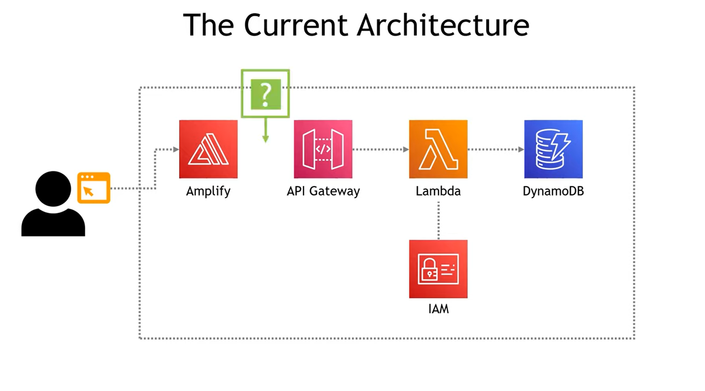

# PDOP-1-BUILD-WEB-APP-ON-AWS
this is a web application that has deployed in AWS using aws amplify, api gateway,lambda function,dynamoDB,and IAM permissions.

### further details:
- AWS amplify has been used to build and host the web appliation
- Lambda function was used to implement the function of the "power" of the in put number
- API gateway was integrated with lambda function to trigger it , when the api request it used from the app.
- Dynamodb used to store the result of lambda function.
- A permission has been added to lambda function to store the result of the function in dynamodb.

## The Deployment Architecture
  
## The App in Action
  

### References :
- This project from Tiny Technical Tutorials:
  https://www.youtube.com/watch?v=7m_q1ldzw0U&list=PLwyXYwu8kL0wMalR9iXJIPfiMYWNFWQzx

